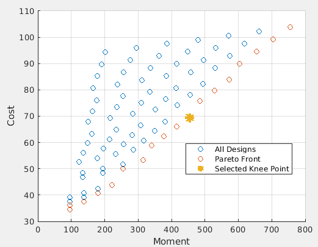
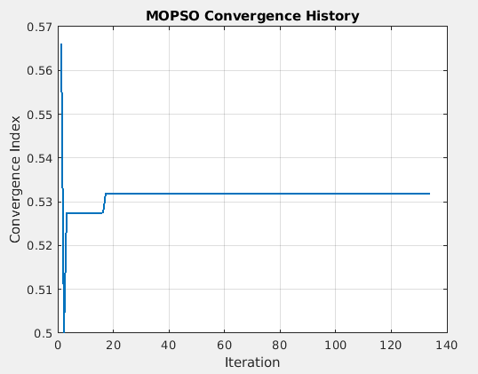

# Discrete MOPSO 
This repository contains a discrete Multi‑Objective Particle Swarm Optimization (MOPSO) implementation in MATLAB for reinforced concrete (RC) beam design selection.
The algorithm selects an optimal beam design from a predefined database by considering structural performance and cost efficiency simultaneously.

## Objectives
- Maximize bending moment capacity  
- Minimize construction cost  

The optimization is performed in minimization form:
- f1 = −Moment  
- f2 = Cost  

## Method
- Discrete particle representation (design index)
- Pareto dominance for pbest and archive update
- External Pareto archive
- Leader selection from archive
- Knee point method for final solution selection

## Input
`data.xlsx` containing:
- `Cost`
- `M1_pos`, `M2_pos`

Moment is calculated as:

## Output
 Pareto front (Moment vs Cost)
 Convergence history
 Selected optimal design (knee point)

- Pareto Front
  

- convergence
  

## Author
Mohammad Mahdi Khaligh
